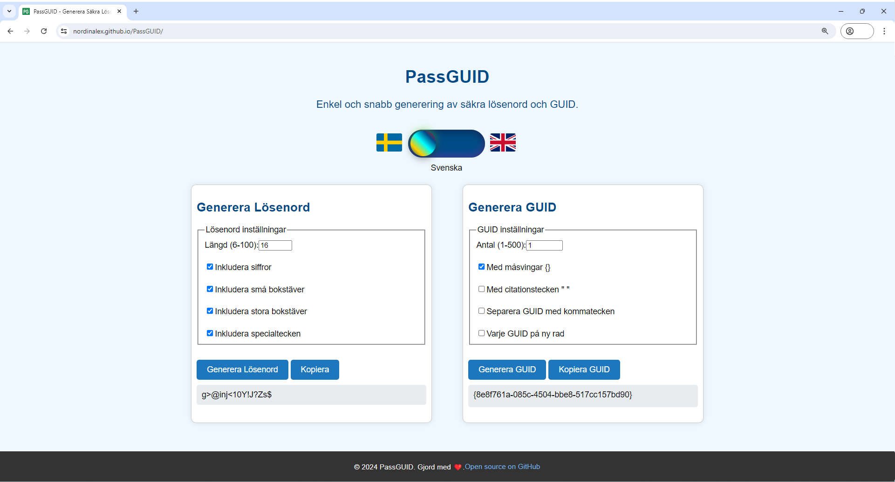

# PassGUID

PassGUID är ett enkelt och snabbt verktyg för att generera säkra lösenord och GUID (Globally Unique Identifier).

Du kan också se den live på: [PassGUID](https://nordinalex.github.io/PassGUID/)
## Funktioner

- **Lösenordsgenerator**: Genererar starka och säkra lösenord med valbara inställningar:
  - Längd (6-100 tecken)
  - Inkludera siffror
  - Inkludera små bokstäver
  - Inkludera stora bokstäver
  - Inkludera specialtecken

- **GUID Generator**: Genererar en eller flera GUIDs med valbara format:
  - Antal (1-500)
  - Med måsvingar {}
  - Med citationstecken ""
  - Separera GUIDs med kommatecken
  - Separera varje GUID på ny rad

## Installation
1. Klona eller ladda ner detta repository:
   ```bash
   git clone https://github.com/NordinAlex/PassGUID.git
   ```
Öppna index.html i din webbläsare.

## Användning
### Generera Lösenord:
   1. Gå till sektionen "Generera Lösenord".
   2. Ställ in önskade lösenordsinställningar (längd, inkluderade tecken).
   3. Klicka på "Generera Lösenord".
   4. Det genererade lösenordet visas under knappen.
   6. Klicka på "Kopiera" för att kopiera lösenordet till urklippet.
### Generera GUID:
 1. Gå till sektionen "Generera GUID".
 3. Ställ in önskade GUID-inställningar (antal, format).
 4. Klicka på "Generera GUID".
 5. De genererade GUIDs visas under knappen.
 6. Klicka på "Kopiera GUID" för att kopiera GUIDs till urklippet.
## Filer
**index.html** - Grundstrukturen för webbsidan.
**styles.css** - Stilmallar för webbsidan.
**passwordGenerator.js** - JavaScript för lösenordsgeneratorn.
**guidGenerator.js** - JavaScript för GUID-generatorn.
## Bidra
Om du vill bidra till detta projekt, följ dessa steg:

1. Forka detta repository.
2. Skapa en ny branch:

  ```bash
    git checkout -b feature/amazing-feature
```
Gör dina ändringar.
Committa dina ändringar:
  ```bash
    git add .
    git commit -m 'Add some amazing feature'
  ```
Pusha till branchen:
  ```bash
    git push origin feature/amazing-feature
  ```
Skicka en Pull Request.

## Licens
Detta projekt är licensierat under MIT-licensen. Se LICENSE för mer information.

 Made with ❤️.